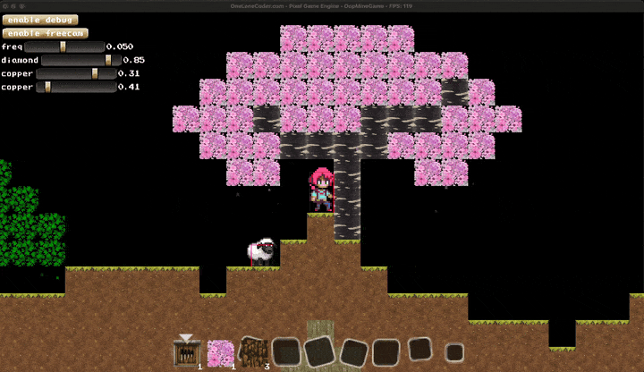

# 文化大學 物件導向程式設計小專題

# 主題：OopMineGame

## 小組資料

- 組別：6
- 系級：資工1A
- 組長：高憲成
- 組員：張育溥、程昱銘
- 報告：https://pres.quazyr.xyz/
- 程式：https://github.com/StarryQuasi/oop-mine-game/tree/main/src

## 分工明細

- 高憲成：GUI 框架開發、程式設計、邏輯整合
- 張育溥：UML/報告撰寫、核心架構 (World/Entity) 構建
- 程昱銘：吃、睡、吃睡

## 遊戲介紹

這是一個使用 C++23 製作的無規則 Minecraft like 2D 沙盒遊戲

### 物件導向

* **繼承**
    * 實體系統：以 [`Entity`](/src/Entity.h) 為基礎，繼承出 [`Mob`](/src/Mob.h) (AI 生物) 與 [`Player`](/src/Player.h) (物理頭髮渲染)，[`Mob`](/src/Mob.h) 下進一步實作 [`Sheep`](/src/Sheep.h) 等生物實現目標選擇
    * 方塊系統：[`Block`](/src/Block.h) 定義基本物理與貼圖，[`CraftingTable`](/src/gui/CraftingTable.h) 透過繼承以擴充介面功能
* **封裝**
    * 所有核心成員變數（如位置、速度、血量）均設為 `protected` 或 `private`，並透過 getter/setter 進行控管與更新偵測
    * [`World`](/src/World.h) 類別封裝了地圖資料與實體列表，外部僅能透過定義好的介面與世界互動，確保資料完整性
* **多型**:
    * 動態綁定：[`World`](/src/World.h) 內部存儲 `std::vector<std::unique_ptr<Entity>>`，在每幀更新時透過虛擬函式 `update()` 與 `render()` 觸發不同實體的行為
    * 虛擬解構子：確保所有繼承後的資源能被正確釋放，防止記憶體洩漏

### 技術亮點

* **程序化內容生成**：
    * 利用柏林噪音生成可重現的 2D 隨機世界
* **模板元程式設計**：
    * 運用 C++ 模板實作 [`Bindable<T>`](/src/Bindable.h) 屬性系統，支援任意資料類型的自動綁定與事件監聽

## 使用資源

> [!NOTE]
> 
> 世界 OOP 架構部分借鑑 [Minecraft](https://www.minecraft.net/)
> 
> 介面 OOP 架構部分借鑑 [osu!framework](https://github.com/ppy/osu-framework)

- [olcPixelGameEngine](https://github.com/onelonecoder/olcpixelgameengine) (OLC-3) - 渲染、碰撞偵測
- [FastNoiseLite](https://github.com/Auburn/FastNoiseLite) (MIT) - 噪音
- [stb_image](https://github.com/nothings/stb) (MIT) - 圖片解碼
- [miniz](https://github.com/richgel999/miniz) (MIT) - 壓縮檔解碼
- [msf_gif](https://github.com/notnullnotvoid/msf_gif) (MIT) - g i f
- [PixelLab](https://www.pixellab.ai/) - AI 生成實體貼圖
- [SummerFields 阿神材質包](https://github.com/SummerFields/SummerFields) (CC BY-NC-SA) - 方塊/介面貼圖

## 授權 License

This project is licensed under the MIT License

See the [LICENSE](/LICENSE) file for more details

## 遊戲執行

> [!NOTE]
> 
> 目前只測試過 Windows 11 x64 (msvc) 及 macOS 15 on Apple Silicon (clang)

| [assets.zip](https://github.com/StarryQuasi/oop-mine-game/releases/latest/download/assets.zip) | [Windows 11 x64](https://github.com/StarryQuasi/oop-mine-game/releases/latest/download/OopMineGame-windows-x64.exe) | [macOS 15 Apple Silicon](https://github.com/StarryQuasi/oop-mine-game/releases/latest/download/OopMineGame-macos-apple) |
| ---------------------------------------------------------------------------------------------- | ------------------------------------------------------------------------------------------------------------------- | ----------------------------------------------------------------------------------------------------------------------- |

- 下載執行檔及 assets.zip
- Windows
  - 開啟執行檔並允許執行
- macOS
  - `cd ~/Downloads && chmod +x ./OopMineGame-macos-apple`
  - 開啟執行檔
  - 到問號按鈕裡面找到允許執行的設定連結
  - 再次開啟執行檔

## 遊戲編譯

- 安裝 git 或 GitHub Desktop
- `git clone https://github.com/StarryQuasi/oop-mine-game`
- ***產生素材檔！***
  - `create_assets_zip` (Windows)
  - `chmod +x ./create_assets_zip.sh` `create_create_assets_zip` (Unix)
- 選擇開發環境

### Visual Studio with msvc
- 安裝 [Visual Studio](https://visualstudio.microsoft.com/downloads/) 並選擇 `C++桌面開發`
- 開啟 `oop-mine-game` 資料夾
- 綠色空心箭頭 `ctrl+f5` 執行
- 綠色實心箭頭 `f5` 除錯

### VSCode with clang (建議使用)
- 安裝編譯器 (Windows)
    - 安裝 [Visual Studio](https://visualstudio.microsoft.com/downloads/) 並選擇 `C++桌面開發`
    - 安裝 [Chocolatey](https://chocolatey.org/install)
    - 以系統管理員身分執行 `choco install cmake llvm -y`
- 安裝編譯器 (macOS)
    - `brew install llvm`
- 安裝 [VSCode](https://code.visualstudio.com/download)
- 安裝 `clangd` `CMake Tools` `CodeLLDB` 插件
- 開啟 `oop-mine-game` 資料夾
- 選擇編譯器路徑 (確保使用剛剛安裝的最新編譯器)
  - `ctrl+shift+p` -> `CMake：Select a Kit`
  - `Clang 22.1.0 x86_64-pc-windows-msvc` (Windows)
  - `Clang 22 (Homebrew)` (macOS)
- `shift+f5` 執行
- `f5` 除錯 (記得至側邊攔 `執行與偵錯` 選擇 `Debug lldb`)

## 遊戲畫面

## UML Diagram

*已簡化*

